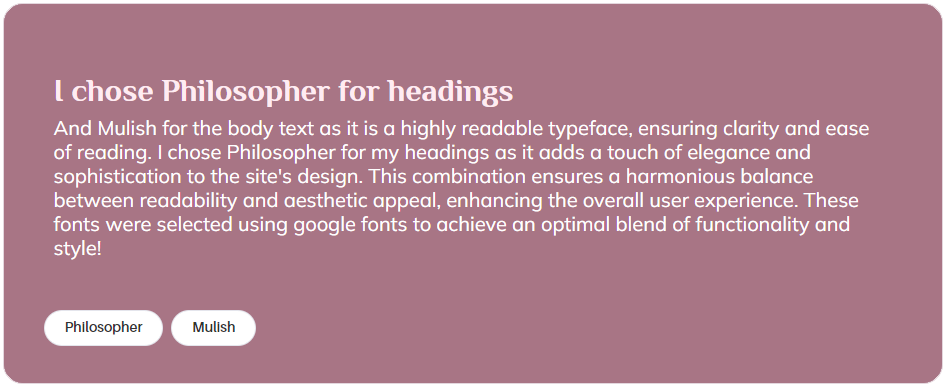

# LitCrit

## Introduction

Welcome to LitCrit, a book review sharing platform for book girlies and boyos alike. Users can browse books and reviews, leave their own additions and connect with other like minded individuals.


[Live FrontEnd (React)](https://pp5-litlounge-react-7f64f8e06883.herokuapp.com/) _(ctrl+left click to open in new window)_<br>
[Live BackEnd (DRF api)](https://pp5-litlounge-7b597e44d7be.herokuapp.com/) _(ctrl+left click to open in new window)_<br>

## Table of Contents

- [Introduction](#introduction)
- [Table of Contents](#table-of-contents)
- [UX](#ux)
  - [User Stories](#user-stories)
  - [Admin Stories](#admin-stories)
  - [Website Goals](#website-goals)
  - [Requirements](#requirements)
  - [Agile Approach](#agile-approach)
- [Structure](#structure)
  - [Database Models](#database-models)
  - [UX and Design](#ux-and-design)
  - [React Components](#react-components)
  - [Wireframes](#wireframes)
- [Features](#features)
  - [Home Page](#home-page)
  - [Navbar](#navbar)
  - [Sign Up Page](#sign-up-page)
  - [Sign In Page](#sign-in-page)
  - [Avatar](#avatar)
  - [Search Bars](#search-bars)
  - [Reviews](#reviews)
  - [Add a Review](#add-a-review)
  - [Review Page](#review-page)
  - [Reader Profile Page](#reader-profile-page)
  - [Followers](#followers)
- [CRUD Functionality](#crud-functionality)
  - [Sign up](#sign-up)
  - [Reader Profile](#reader-profile)
  - [Books](#books)
  - [Review](#review)
  - [Comments](#comments)
- [Testing](#testing)
  - [Front End](#front-end)
    - [HTML Testing](#html-testing)
    - [CSS Testing](#css-testing)
    - [Manual Testing](#manual-testing)
  - [Back End](#back-end)
    - [Pylint Testing](#pylint-testing)
    - [Manual Testing](#manual-testing-1)
  - [Bugs](#bugs)
- [Future Development](#future-development)
- [Technologies Used](#technologies-used)
  - [Languages](#languages)
  - [Libraries & Framework](#libraries---framework)
  - [Databases](#databases)
  - [Tools](#tools)
- [Development and Deployment](#development-and-deployment)
  - [Development](#development)
  - [Deployment](#deployment)
    - [Backend](#backend)
    - [Frontend](#frontend)
- [Credits](#credits)

## UX

### User Stories

For my first submission of this project, I made an agile project board that can be found [here](https://github.com/users/ArcLiz/projects/5). Not only was this project and it's respective project board rushed, but it was also done and created before I had a clear idea of where I wanted this project to go. For the resubmission I have worked from the user stories below, and I have created a new project board which is attached to this repository, where I've combined the front- and backend stories but instead broken each story down into acceptance criteria that reflects both front- and backend development.

#### Basic Structure and Experience

- As a user I want to be able to understand what the site is
- As a user I want to be able to navigate the site easily and intuitively
- As an unregistered user I want to be able to register an account
- As a registered user I want to be able to log into the site
- As a logged in user I want to be able to log out from the site

#### Books

- As a user I want to be able to see a list of all available books
- As a user I want to be able to search for books that matches my query
- As a logged in user I want to be able to add new books to the site
- As a logged in user I want to be able to see detailed information about a book when I click on it

#### Reviews

- As a logged in user I want to be able to post reviews for any book
- As a logged in user I want to be able to edit or delete a review I've written
- As a logged in user I want to be able to like/unlike reviews
- As a logged in user I want to be able to see all reviews for a specific book
- As a logged in user I want to be able to see all reviews from a specific user

#### Profiles

- As a logged in user I want to have my own profile page
- As a logged in user I want to have a profile picture
- As a logged in user I want to be able to edit my profile and picture
- As a logged in user I want to be able to find other users
- As a logged in user I want to be able to follow/unfollow other users

### Admin Stories

- As an administrator I want to be able to edit book details
- As an administrator I want to be able to delete books
- As an administrator I want to be able to delete offensive or otherwise inappropriate reviews

### Website Goals

#### Current Goals:

The primary objective of this project is to provide users with a robust platform for book reviews and interactions. Users can create accounts, browse existing books, add new books, submit reviews, like reviews, create their own profile pages, and connect with other users through liking and interacting with their profiles. This creates an environment that invites for conversation and allows users to find more books that could potentially be their upcoming favourites.

#### Long Term Goals:

The long-term vision for this website extends beyond its current functionalities. It aims to integrate with my previous library project, transforming into a comprehensive book hub tailored for avid readers, enthusiasts, and collectors alike. This integrated platform will allow users to not only manage their personal libraries efficiently but also to engage within a community of book lovers. Features will include access to personal book collections, usage of tools such as the Google Books API for a vast database of titles. Additionally, users will be able to connect with others in a larger extent, e.g. send private messages, share recommendations, engage in general discussions, and generally connect through shared literary interests.

This evolution will consolidate the functionalities of both projects, offering a unified experience where users can seamlessly blend personal library management with community interaction, enhancing their overall reading and book-sharing experiences.

### Requirements

#### Pages
- **Home Page**: The main landing page of the site.
- **Book List**: A page displaying a list of all books.
- **Book Details**: A detailed view of individual books.
- **User List**: A page showcasing a list of all users.
- **Profile Page**: A personal page for each user displaying their information and activity.
- **Admin Panel**: A dedicated interface for administrators to manage site content.

#### Functionality
- **Register Account**: Users can create new accounts.
- **Sign in / Log out**: Users can authenticate and terminate their sessions.
- **Set up a User Profile**: Users can create and customize their profiles.
- **Add Books**: Users can add new books to the platform.
- **Book Search**: Users can search for books by title, author and other relevant information.
- **Write Reviews**: Users can post reviews for books.
- **Edit One's Own Content**: Users can modify their own content, such as profiles and reviews.
- **Follow/Unfollow Users**: Users can follow or unfollow other users.
- **Like/Unlike Reviews**: Users can like or unlike reviews posted by others.


## Structure

This project is structured across two separate repositories, each dedicated to distinct aspects of the application. The frontend is developed using JavaScript React, incorporating reusable components to ensure scalability as well as custom page layouts. Bootstrap, specifically react-bootstrap v1.6.8, along with custom styling, is utilized to organize and style the user interface. The backend leverages Django Rest Framework to manage all necessary data, facilitating seamless data access and storage between the frontend and the database. This division of responsibilities ensures a modular, maintainable, and scalable architecture.

### Database Models


### Wireframes

During the initial planning phase of the project, I did not have a concrete vision. Instead, I experimented with the wireframe sketching tool Balsamiq to create a preliminary version based on the walkthrough project Moments, incorporating the Books pages I intended to develop. Upon reviewing the original sketches after receiving resubmission instructions, I noticed the use of an accordion component in the initial designs. This discovery led me to incorporate the accordion feature into the current version, aligning with the original conceptual framework and enhancing the overall user experience.

#### Home Page


#### Book List


#### Book Details


#### Profile Page


### React Components
#### NavBar
The NavBar component is persistently displayed at the top of every page, facilitating seamless navigation for users across the site.

#### LikeButton
The LikeButton component is integrated within various review accordions, enabling users to like or unlike reviews with ease.

#### Asset
The Asset component functions as a loading spinner, providing visual feedback during all page load scenarios.

#### NoCurrentUser
The NoCurrentUser component is displayed when a logged-out user attempts to access a page restricted to logged-in users, guiding them appropriately.

#### StarRating
The StarRating component enhances the visual presentation of user reviews by providing an intuitive star-based rating system.

#### ActivityFeed
The ActivityFeed component displays the latest user follows and reviews on the profile being viewed, keeping users updated on recent activities.

#### NotFound
The NotFound component serves as a 404 error page, appearing when users navigate to a non-existent URL or an invalid ID.

#### List Components
The PopularBooks, PopularUsers, and NewestUsers components dynamically list details of the most popular and newly added books and user profiles, providing users with up-to-date information.

### Design

#### Fonts



#### Colour Scheme

To create a light and airy atmosphere, the website primarily uses a pastel color scheme, complemented by black, white, and Bootstrap's warning/danger colors for emphasis. The user interface features soft pink tones, creating a welcoming environment, with dark green buttons to highlight image upload actions. The administrative interface is distinctly set apart with a green palette, clearly delineating administrative functions from regular user interactions. This thoughtful use of color ensures a visually appealing and intuitively navigable site.


### React Components

## Features

### User Authentication


- **User Registration**: Users can register with valid data and handle errors for missing required fields and duplicate registrations.
- **User Login**: Authentication ensures users can log in with valid credentials and handle errors for invalid login attempts.
- **User Logout**: Users can successfully log out, and the logout process redirects them appropriately.

### Site Navigation

- **Visiting User**: Vising users (not logged in) will see the site logo and sign in / sign up buttons in their navigation bar 

- **Normal User**: Normal users (logged in) will see the site logo and Home, Books, Readers, Sign Out and Profile buttons in their navigation bar 

- **Admin User**: Admin users (logged in) will see the site logo and Home, Books, Readers, Admin, Sign Out and Profile buttons in their navigation bar 

### Profiles (Readers)

- **Create Profile**: Profiles are automatically created upon account creation.
- **Retrieve Profile**: Profile details are viewed correctly in a responsive layout.
- **Recent Activity**: Users can see recent reviews and follows by the specific user.
  
  
  <br><br>
- **User Reviews Accordion**: Users can see all reviews written by the specific user in an accordion. 
  <br><br>
- **Edit Profile Button**: Profile owners can edit their profiles.
- **Follow/Unfollow Profile**: Users can follow and unfollow _other_ profiles.
  

### Books

- **Create Book**: Books are created with a modal form which alerts the user if incorrect data is being added. The genres are added with a tag system that allows the user to add multiple genres to one book by pressing enter between each.
  
  
  <br><br>
- **Book List**: All books are correctly retrieved in list view with the most important details and links to a Book Details Page.
  
  <br><br>
- **Book Search**: Users can search/filter books by title, author, genre and series
  
  <br><br>
- **Book Details**: Book details are viewed correctly in a responsive layout, with a Popular Books component to the left to invite more book browsing.
  
  <br><br>
- **Add Review**: A button to add a review is present in the top right corner of the Reviews section, whereas if a user has already reviewed the particular book, it will instead show Edit Review. (See Reviews section for imagery)
- **Book Reviews Accordion**: Users can see all reviews written for the specific book in an accordion.
  

### Reviews

- **Create Review**: Reviews are created with valid data, and duplicate reviews for the same book by the same user are prevented.
- **Edit Review**: Review owners can edit their reviews.
- **Delete Review**: Review owners can delete their reviews.
- **Edit/Delete Review Button**: If a review in a Review Accordion (Book Details or Profile Details) belongs to the logged in user, a cog icon button is shown in the top right of the review, for the user to Edit or Delete their review.
  
  
  <br><br>
- **Like/Unlike Review**: Users can like and unlike reviews, preventing multiple likes by the same user.
  

### Follows

- Follow/Unfollow User is featured in Profile Details page, Popular Users component and Newest Users component. If ones own account is listed in any of the user components, the follow button is not visible. (See User Components below for imagery)

### Home Page

- **Popular Books Component**: Displays popular books correctly with functional links to book detail pages.
  
  <br><br>
- **Popular Users Component**: Displays popular users correctly with functional links to user profile pages, the link being located on the User Avatar.
- **Newest Users Component**: Displays newest users correctly with functional links to user profile pages, the link being located on the User Avatar.
  

### Admin Dashboard

- **Dashboard Slider**: Admins can use the slider to open relevant admin tables.
  
- **Books Table**: Lists all books correctly. When hovering over description, the full description and genres/series information is showed in a popover.
- **Delete Book (Admin)**: Admins can delete books.
  
  
- **Edit Book (Admin)**: Admins can update book details.
  
- **Reviews Table**: Lists all reviews correctly.
- **Delete Review (Admin)**: Admins can delete reviews.
  

## CRUD Functionality

<br>
**Notes:**

- Book update and deletion are restricted to Administrators. This measure prevents accidental or malicious deletion of books with significant user interaction.
- List views are accessible to all visitors, while detailed pages are restricted to logged-in users.

## Testing

I have chosen to manually test both the frontend and backend of this project. To ensure comprehensive coverage of the front end application, I both conducted extensive testing myself and enlisted the help of developer friends and family members. This collaborative approach helps identify issues that I might overlook due to familiarity with the project. The results of these tests are detailed below, in a merged table for both parts of the project. You'll find the google sheet [here](https://docs.google.com/spreadsheets/d/16B1a5lpXJuM2qzAYTVTJ20N8TG_gCjfgIQ6_cVyjiw4/edit?usp=sharing) in case the below table is unclear.

### Initial Testing

| Category            | Test Case               | Description                                                                         | Test Environment                  | Issues                                                          | Outcome |
| ------------------- | ----------------------- | ----------------------------------------------------------------------------------- | --------------------------------- | --------------------------------------------------------------- | ------- |
| User Authentication | User Registration       | Ensure users can register with valid data.                                          | Windows 11 Desktop, Google Chrome | None                                                            | PASS    |
| User Authentication | User Registration       | Test for registration with missing required fields.                                 | Windows 11 Desktop, Google Chrome | None                                                            | PASS    |
| User Authentication | User Registration       | Verify error handling for duplicate registrations (same username).                  | Windows 11 Desktop, Google Chrome | None                                                            | PASS    |
| User Authentication | User Login              | Ensure users can log in with valid credentials.                                     | Windows 11 Desktop, Google Chrome | None                                                            | PASS    |
| User Authentication | User Login              | Verify error handling for invalid login credentials.                                | Windows 11 Desktop, Google Chrome | None                                                            | PASS    |
| User Authentication | User Logout             | Ensure users can log out successfully.                                              | Windows 11 Desktop, Google Chrome | None                                                            | PASS    |
| User Authentication | User Logout             | Ensure the logout process works correctly and the user is redirected appropriately. | Windows 11 Desktop, Google Chrome | None                                                            | PASS    |
| Profiles            | Create Profile          | Ensure profiles are created with valid data.                                        | Windows 11 Desktop, Google Chrome | None                                                            | PASS    |
| Profiles            | Update Profile          | Ensure profile updates correctly with valid data.                                   | Windows 11 Desktop, Google Chrome | None                                                            | PASS    |
| Profiles            | Update Profile          | Test profile updates with invalid data.                                             | Windows 11 Desktop, Google Chrome | Alert missing upon doc/video/music upload instead of image file | FIX     |
| Profiles            | Retrieve Profile        | Verify profile details can be retrieved for a valid user.                           | Windows 11 Desktop, Google Chrome | None                                                            | PASS    |
| Profiles            | Retrieve Profile        | Check the response for an invalid user profile request.                             | Windows 11 Desktop, Google Chrome | White page, 404 page missing?                                   | FIX     |
| Profiles            | Follow/Unfollow Profile | Ensure users can follow/unfollow other profiles.                                    | Windows 11 Desktop, Google Chrome | None                                                            | PASS    |
| User Profile        | Edit Profile Button     | Verify the edit profile option is available for the profile owner.                  | Windows 11 Desktop, Google Chrome | None                                                            | PASS    |
| User List           | User List Display       | Ensure the user list displays correctly with all users.                             | Windows 11 Desktop, Google Chrome | None                                                            | PASS    |
| User List           | User List Display       | Verify infinite scroll works correctly.                                             | Windows 11 Desktop, Google Chrome | None                                                            | PASS    |
| User Profile        | Profile Display         | Ensure profile details are displayed correctly.                                     | Windows 11 Desktop, Google Chrome | None                                                            | PASS    |
| User Profile        | Profile Display         | Verify the accordion lists user's reviews correctly.                                | Windows 11 Desktop, Google Chrome | None                                                            | PASS    |
| User Profile        | Follow/Unfollow Button  | Ensure the follow/unfollow button works correctly for other users.                  | Windows 11 Desktop, Google Chrome | None                                                            | PASS    |
| Books               | Create Book             | Ensure books are created with valid data.                                           | Windows 11 Desktop, Google Chrome | None                                                            | PASS    |
| Books               | Create Book             | Test for book creation with missing required fields (title, author, description).   | Windows 11 Desktop, Google Chrome | None                                                            | PASS    |
| Books               | Edit Book (Admin)       | Ensure books can be updated correctly with valid data.                              | Windows 11 Desktop, Google Chrome | None                                                            | PASS    |
| Books               | Edit Book (Admin)       | Test book update with invalid data.                                                 | Windows 11 Desktop, Google Chrome | Alert missing upon doc/video/music upload instead of image file | FIX     |
| Books               | Delete Book (Admin)     | Ensure books can be deleted by admin.                                               | Windows 11 Desktop, Google Chrome | None                                                            | PASS    |
| Books               | Delete Book (Admin)     | Verify error handling when non-admin users try to delete a book.                    | Windows 11 Desktop, Google Chrome | None                                                            | PASS    |
| Books               | Retrieve Book(s)        | Verify all books are correctly retrieved in list view.                              | Windows 11 Desktop, Google Chrome | None                                                            | PASS    |
| Books               | Retrieve Book           | Verify book details are correctly retrieved.                                        | Windows 11 Desktop, Google Chrome | None                                                            | PASS    |
| Books               | Retrieve Book           | Test retrieval for non-existent books.                                              | Windows 11 Desktop, Google Chrome | "Empty" Book Details page, 404 page missing                     | FIX     |
| Reviews             | Create Review           | Ensure reviews are created with valid data.                                         | Windows 11 Desktop, Google Chrome | None                                                            | PASS    |
| Reviews             | Create Review           | Verify duplicate review creation for the same book by the same user is not allowed. | Windows 11 Desktop, Google Chrome | None                                                            | PASS    |
| Reviews             | Edit Review             | Ensure reviews can be edited by their owners.                                       | Windows 11 Desktop, Google Chrome | None                                                            | PASS    |
| Reviews             | Edit Review             | Verify error handling for review editing by non-owners.                             | Windows 11 Desktop, Google Chrome | None                                                            | PASS    |
| Reviews             | Delete Review           | Ensure reviews can be deleted by their owners.                                      | Windows 11 Desktop, Google Chrome | None                                                            | PASS    |
| Reviews             | Delete Review           | Verify error handling for review deletion by non-owners.                            | Windows 11 Desktop, Google Chrome | None                                                            | PASS    |
| Reviews             | Like/Unlike Review      | Ensure reviews can be liked/unliked by users.                                       | Windows 11 Desktop, Google Chrome | None                                                            | PASS    |
| Reviews             | Like/Unlike Review      | Verify the same user cannot like a review multiple times.                           | Windows 11 Desktop, Google Chrome | None                                                            | PASS    |
| Reviews             | Delete Review (Admin)   | Ensure reviews can be deleted by admin.                                             | Windows 11 Desktop, Google Chrome | None                                                            | PASS    |
| Reviews             | Delete Review (Admin)   | Verify error handling when non-admin users try to delete a review.                  | Windows 11 Desktop, Google Chrome | None                                                            | PASS    |
| Follows             | Follow/Unfollow Profile | Ensure follow/unfollow actions work as expected.                                    | Windows 11 Desktop, Google Chrome | None                                                            | PASS    |
| Follows             | Follow/Unfollow Profile | Verify following oneself is not allowed.                                            | Windows 11 Desktop, Google Chrome | Following oneself works...                                      | FIX     |
| Navbar              | Logged Out User         | Ensure appropriate icons and options are visible for logged-out users.              | Windows 11 Desktop, Google Chrome | None                                                            | PASS    |
| Navbar              | Logged Out User         | Verify navigation links redirect to login/register pages.                           | Windows 11 Desktop, Google Chrome | None                                                            | PASS    |
| Navbar              | Logged In Normal User   | Ensure appropriate icons and options are visible for normal logged-in users.        | Windows 11 Desktop, Google Chrome | None                                                            | PASS    |
| Navbar              | Logged In Normal User   | Verify navigation links work correctly.                                             | Windows 11 Desktop, Google Chrome | None                                                            | PASS    |
| Navbar              | Admin User              | Ensure admin-specific icons and options are visible for admin users.                | Windows 11 Desktop, Google Chrome | None                                                            | PASS    |
| Navbar              | Admin User              | Verify admin links redirect to admin dashboard.                                     | Windows 11 Desktop, Google Chrome | None                                                            | PASS    |
| Home Page           | Popular Books Component | Ensure the popular books component displays correctly.                              | Windows 11 Desktop, Google Chrome | None                                                            | PASS    |
| Home Page           | Popular Books Component | Verify links to book detail pages work correctly.                                   | Windows 11 Desktop, Google Chrome | None                                                            | PASS    |
| Home Page           | Popular Users Component | Ensure the popular users component displays correctly.                              | Windows 11 Desktop, Google Chrome | None                                                            | PASS    |
| Home Page           | Popular Users Component | Verify links to user profile pages work correctly.                                  | Windows 11 Desktop, Google Chrome | None                                                            | PASS    |
| Home Page           | Newest Users Component  | Ensure the newest users component displays correctly.                               | Windows 11 Desktop, Google Chrome | None                                                            | PASS    |
| Home Page           | Newest Users Component  | Verify links to user profile pages work correctly.                                  | Windows 11 Desktop, Google Chrome | None                                                            | PASS    |
| Admin Dashboard     | Dashboard Slider        | Verify that the slider works to open the relevant admin table.                      | Windows 11 Desktop, Google Chrome | None                                                            | PASS    |
| Admin Dashboard     | Books Table             | Ensure the books table lists all books correctly.                                   | Windows 11 Desktop, Google Chrome | None                                                            | PASS    |
| Admin Dashboard     | Books Table             | Verify admins can edit book details.                                                | Windows 11 Desktop, Google Chrome | None                                                            | PASS    |
| Admin Dashboard     | Books Sub Table         | Ensure admins can delete inappropriate/offensive books.                             | Windows 11 Desktop, Google Chrome | None                                                            | PASS    |
| Admin Dashboard     | Reviews Sub Table       | Ensure the reviews table lists all reviews correctly.                               | Windows 11 Desktop, Google Chrome | None                                                            | PASS    |
| Admin Dashboard     | Reviews Sub Table       | Verify admins can delete inappropriate/offensive reviews.                           | Windows 11 Desktop, Google Chrome | None                                                            | PASS    |

### Retesting the fixes

| Category | Test Case               | Description                                             | Test Environment                  | Updated Note                                                | Outcome |
| -------- | ----------------------- | ------------------------------------------------------- | --------------------------------- | ----------------------------------------------------------- | ------- |
| Profiles | Update Profile          | Test profile updates with invalid data.                 | Windows 11 Desktop, Google Chrome | Added alerts to image file field                            | PASS    |
| Profiles | Retrieve Profile        | Check the response for an invalid user profile request. | Windows 11 Desktop, Google Chrome | NotFound component added globally and to profile/faulty:id  | PASS    |
| Books    | Edit Book (Admin)       | Test book update with invalid data.                     | Windows 11 Desktop, Google Chrome | Added alerts to image file field                            | PASS    |
| Books    | Retrieve Book           | Test retrieval for non-existent books.                  | Windows 11 Desktop, Google Chrome | NotFound component added globally and to book/faulty:id     | PASS    |
| Follows  | Follow/Unfollow Profile | Verify following oneself is not allowed.                | Windows 11 Desktop, Google Chrome | Removed follow icon for own profile in Popular/Newest Users | PASS    |

### Responsivity Testing

Due to using Apple devices for personal use, I haven't been able to physically test the project on mobile devices. This limitation likely stems from Apple's stringent SSL requirements, which can affect compatibility. To work around this, I conducted testing using both my Windows desktop and MacBook Air laptop. I utilized Google Chrome's developer tools to simulate various devices such as iPhone SE, iPhone 12 Pro, and iPad Air, adjusting screen sizes accordingly.

| Category            | Test Case    | Comments                                                            | Test Environment       |
| ------------------- | ------------ | ------------------------------------------------------------------- | ---------------------- |
| Home                | Desktop (XL) | Fine - No comments                                                  | Google Chrome Dev Tool |
|                     | Laptop (L)   | Fine - No comments                                                  | Apple Macbook M1       |
|                     | Tablet (M)   | Fine - No comments                                                  | Google Chrome Dev Tool |
|                     | Phone (S)    | Fine - No comments                                                  | Google Chrome Dev Tool |
|                     | Phone (XS)   | Fine - No comments                                                  | Google Chrome Dev Tool |
| Sign Up             | Desktop (XL) | Fine - No comments                                                  | Google Chrome Dev Tool |
|                     | Laptop (L)   | Fine - No comments                                                  | Apple Macbook M1       |
|                     | Tablet (M)   | Fine - No comments                                                  | Google Chrome Dev Tool |
|                     | Phone (S)    | Fine - No comments                                                  | Google Chrome Dev Tool |
|                     | Phone (XS)   | Fine - No comments                                                  | Google Chrome Dev Tool |
| Sign In             | Desktop (XL) | Fine - No comments                                                  | Google Chrome Dev Tool |
|                     | Laptop (L)   | Fine - No comments                                                  | Apple Macbook M1       |
|                     | Tablet (M)   | Fine - No comments                                                  | Google Chrome Dev Tool |
|                     | Phone (S)    | Fine - No comments                                                  | Google Chrome Dev Tool |
|                     | Phone (XS)   | Fine - No comments                                                  | Google Chrome Dev Tool |
| Navbar              | Desktop (XL) | Fine - No comments                                                  | Google Chrome Dev Tool |
|                     | Laptop (L)   | Fine - No comments                                                  | Apple Macbook M1       |
|                     | Tablet (M)   | Fine - No comments                                                  | Google Chrome Dev Tool |
|                     | Phone (S)    | Fine - No comments                                                  | Google Chrome Dev Tool |
|                     | Phone (XS)   | Fine - No comments                                                  | Google Chrome Dev Tool |
| Book List           | Desktop (XL) | Fine - No comments                                                  | Google Chrome Dev Tool |
|                     | Laptop (L)   | Fine - No comments                                                  | Apple Macbook M1       |
|                     | Tablet (M)   | Fine - No comments                                                  | Google Chrome Dev Tool |
|                     | Phone (S)    | Fine - No comments                                                  | Google Chrome Dev Tool |
|                     | Phone (XS)   | Fine - No comments                                                  | Google Chrome Dev Tool |
| Book Detail         | Desktop (XL) | Fine - No comments                                                  | Google Chrome Dev Tool |
|                     | Laptop (L)   | Fine - No comments                                                  | Apple Macbook M1       |
|                     | Tablet (M)   | Fine - No comments                                                  | Google Chrome Dev Tool |
|                     | Phone (S)    | Fine - No comments                                                  | Google Chrome Dev Tool |
|                     | Phone (XS)   | Fine - No comments                                                  | Google Chrome Dev Tool |
| Profile List        | Desktop (XL) | Fine - No comments                                                  | Google Chrome Dev Tool |
|                     | Laptop (L)   | Fine - No comments                                                  | Apple Macbook M1       |
|                     | Tablet (M)   | Fine - No comments                                                  | Google Chrome Dev Tool |
|                     | Phone (S)    | Meh, kind of weird use of space but nothing's "out of place" per se | Google Chrome Dev Tool |
|                     | Phone (XS)   | Fine - No comments                                                  | Google Chrome Dev Tool |
| Profile Detail      | Desktop (XL) | Fine - No comments                                                  | Google Chrome Dev Tool |
|                     | Laptop (L)   | Fine - No comments                                                  | Apple Macbook M1       |
|                     | Tablet (M)   | Fine - No comments                                                  | Google Chrome Dev Tool |
|                     | Phone (S)    | Fine - No comments                                                  | Google Chrome Dev Tool |
|                     | Phone (XS)   | Fine - No comments                                                  | Google Chrome Dev Tool |
| Admin Dashboard     | Desktop (XL) | Fine - No comments                                                  | Google Chrome Dev Tool |
|                     | Laptop (L)   | Fine - No comments                                                  | Apple Macbook M1       |
|                     | Tablet (M)   | Fine - No comments                                                  | Google Chrome Dev Tool |
|                     | Phone (S)    | Fine - No comments                                                  | Google Chrome Dev Tool |
|                     | Phone (XS)   | Fine - No comments                                                  | Google Chrome Dev Tool |
| Admin Books Table   | Desktop (XL) | Fine - No comments                                                  | Google Chrome Dev Tool |
|                     | Laptop (L)   | Fine - No comments                                                  | Apple Macbook M1       |
|                     | Tablet (M)   | Fine - No comments                                                  | Google Chrome Dev Tool |
|                     | Phone (S)    | Fine - No comments                                                  | Google Chrome Dev Tool |
|                     | Phone (XS)   | Fine - No comments ^                                                | Google Chrome Dev Tool |
| Admin Reviews Table | Desktop (XL) | Fine - No comments                                                  | Google Chrome Dev Tool |
|                     | Laptop (L)   | Fine - No comments                                                  | Apple Macbook M1       |
|                     | Tablet (M)   | Fine - No comments                                                  | Google Chrome Dev Tool |
|                     | Phone (S)    | Fine - No comments                                                  | Google Chrome Dev Tool |
|                     | Phone (XS)   | Fine - No comments                                                  | Google Chrome Dev Tool |

### HTML Testing
I found HTML testing to be quite challenging with React due to the JSX and constant JavaScript inserts even in the render. However, when checking all pages on W3's HTML validator, it came back clean, with information about no effect trailing slashes.

### CSS Testing
CSS files came back with "Congratulations! No Error Found" on all files except `ReaderList.module.css`, which states that line 31 .card has a "Parse Error &
". However, these styles do get applied, so I have not done anything to that error

### Pylint Testing
The `Book`, `Follow`, `Like`, `Profile`, and `Review` models, serializers, and views have all been checked using the CI Python Linter. All clear, no errors found.

The only exception is in book.views, where line 5 is too long (81 characters > 79 characters). However, since this is an import statement, I felt the additional 2 characters are acceptable.

For the same reason as above, I did not check settings.py for linting errors, as the few lines that are usually too long are Django's own default settings.

### Known Issues

I am currently aware of several issues that either do not function correctly or do not behave as intended. Below are the details of the main one, but please note that this list is not exhaustive:

- **Console Error - 'controlId' Warning:**<br>
  When using the Create Book Form, a console error occurs stating "'controlId' is ignored on 'FormLabel' when 'htmlFor' is specified." This issue arises from the controlId and htmlFor attributes both being used for the cover image upload. Attempts to resolve this by removing one of the attributes resulted in the functionality ceasing to work altogether.

- **Duplicate Book Creation:**<br>
  There is a functionality issue where it is possible to create multiple copies of the same book. Ideally, the system should perform a search by book title upon form submission to inform the user if a book with the same title exists. The user would then have the option to proceed with the creation or cancel. Despite ensuring that the API supports title searches, I have not yet successfully implemented this feature.

- **Incorrect Profile Details When Editing:**<br>
  Occasionally, users have reported encountering incorrect details pre-populated in the Edit Profile form when transitioning directly from another user's profile to their own. Editing and saving these details correctly updates the user's own profile, but the pre-populated form data may display details from the previous user visited.

- **Hover box in Admin Books:**<br>
  When hovering over the description of books in the admin book panel, the box gets cut off if it moves outside the table borders.

- **Small random things:**<br>
  Things like Links not being exactly the size one would expect in profile lists, create/edit reviews etc is on my list of things to fix for the combined project further on, but in my book they've been deemed UX-luxuries rather than necessities and they've been down prioritised in this particular project.

## Future Development

While the below list is not exhaustive, it represents a selection of future development goals aimed at enhancing the platform's functionality and user experience.

- Adding a user library feature where users can add the books they own and display this on their page
- Usage of Google Books API for easier addition of books to project databases
- Messaging system between Users
- Friend system (Users follow eachother = Friend)
- News Feed tailored to the users followed users, authors and series
- Commenting capabilities for book reviews

## Technologies Used

### Backend

- **Django REST Framework (DRF)**: Powerful and flexible toolkit for building Web APIs in Python.
- **django-allauth**: Integrated set of Django applications addressing authentication, registration, account management.
- **dj-rest-auth**: Django REST framework authentication tools including social authentication.
- **django-cloudinary-storage**: Django media storage backend for Cloudinary.
- **djangorestframework-simplejwt**: JSON Web Token authentication support for DRF.

### Frontend

- **React**: JavaScript library for building user interfaces.
- **React Router DOM**: Declarative routing for React.
- **React Bootstrap**: Bootstrap components built with React.
- **axios**: Promise-based HTTP client for the browser and Node.js.
- **lodash**: Utility library delivering consistency, modularity, performance.
- **jwt-decode**: Library to decode JWTs.
- **react-tag-input**: A highly customizable tags input component for React.

### Additional Tools

- **Gunicorn**: Python WSGI HTTP Server for UNIX.
- **Cloudinary**: Cloud-based image and video management services.
- **PostgreSQL (via psycopg2)**: PostgreSQL adapter for Python.
- **Heroku**: Platform as a service (PaaS) used for deployment.
- **Bootstrap**: Front-end framework for developing responsive and mobile-first websites.

### Dependency Management

- **npm**: Package manager for JavaScript.
- **pip**: Package installer for Python.

### Development Environment

- **Node.js**: JavaScript runtime.
- **Python**: Programming language used for backend development.

### Other Services

- **Canva**: Online graphic design tool.
- **Photoshop CC**: Adobe's professional image editing software.
- **Balsamiq**: Wireframing tool for creating mockups.
- **FontAwesome**: Icon toolkit for adding scalable vector icons to projects.


## Development

If you're looking to use this project as a foundation for your own application or if you want to make customizations and improvements, follow the steps below to set up your development environment:

### Forking the GitHub Repository
Forking creates a personal copy of someone else's repository under your GitHub account. This allows you to freely experiment with changes without affecting the original project.

1. Log into your GitHub account and navigate to the repository.
2. Click the **Fork** button at the top right.
3. Choose a name for the forked repository and click **Create Fork**.

### Cloning the GitHub Repository
Cloning is the process of creating a local copy of the repository on your computer. This enables you to work on the project offline and push your changes back to GitHub when ready.

1. Navigate to the repository on GitHub.
2. Click the green **<> Code** button and copy the URL.
3. Open your IDE and ensure Git is installed.
4. In your terminal, run `git clone <URL>`.

### Setting Up Cloudinary

1. Create an account on Cloudinary and log in.
2. Copy the API Environment variable from your dashboard.
3. Add this variable to your `env.py` file.

### Setting Up SQL Database

In my project I used ElephantSQL, who are unfortunately shutting their services down on January 27, 2025. If you have long term plans for a project using a cloud-based PostgreSQL, I would suggest looking at other services such as Heroku PostgreSQL, Amazon RDS, or Google Cloud SQL.

#### Choosing ElephantSQL

1. Create an account on ElephantSQL and log in.
2. Create a new instance with the **Tiny Turtle** plan.
3. Copy the instance URL and add it to your `env.py` file.

### Installing Requirements

Install required API packages with:

```
pip3 install -r requirements.txt
```

Add the following variables to your `env.py` file:

- `DATABASE_URL`: ElephantSQL instance URL
- `SECRET_KEY`: Your secret key
- `CLOUDINARY_URL`: Cloudinary API Environment variable
- `DEV`: Any value indicating development mode (e.g., "1", "True", "BananaWaffles")
- `ALLOWED_HOST`: Development URL

### Front End

Install required JS/React packages with:

```
npm install
```

## Deployment

### Backend

#### Deploying to Heroku

1. Log in to Heroku and create a new app.
2. In the **Settings** tab, add the following config vars (most of which are currently in your `env.py` file):
   - `CLOUDINARY_URL`
   - `DATABASE_URL`
   - `ALLOWED_HOST`
   - `CLIENT_ORIGIN`
   - `CLIENT_ORIGIN_DEV`
   - `SECRET_KEY`
3. Deploy the app from the **Deploy** tab by connecting your GitHub repository and selecting your preferred deployment method.

Heroku will handle the deployment process, and once completed, your app will be live.

## Credits

### Originality of Work

I have incorporated code from the Code Institute Walkthrough projects DRF API and Moments in these repositories. Below is a list of files that were more or less used in their entirety, with only minor adaptations.

#### Code Institute

- `src/contexts/ProfileDataContext.js`
- `src/contexts/CurrentUserContext.js`
- `src/components/Asset.js`
- `src/components/Avatar.js`
- `src/components/NavBar.js`
- `src/components/NotFound.js`
- `src/hooks/useClickOutside.js`
- `src/hooks/useRedirect.js`
- `src/utils/utils.js`
- `/App.module.css`
- `src/styles/Asset.module.css`
- `src/styles/Avatar.module.css`

I also believe that `StarRating.js` is a very close version of Thomas Wharton's similar feature, or at least a mixture of his and the one created by Jonas Schmedtmann in the React Udemy Course listed below.

#### Udemy Courses

Additionally, I have consulted the following Udemy courses:

- [Bootstrap 5 From Scratch](https://www.udemy.com/course/bootstrap-from-scratch/) by Brad Traversy
- [The Ultimate React Course 2024](https://www.udemy.com/course/the-ultimate-react-course/) by Jonas Schmedtmann
- [Python Django - The Practical Guide](https://www.udemy.com/course/python-django-the-practical-guide/) by Maximilian Schwarzmller

#### Acknowledgments

I strive for transparency and integrity in my work. While I have leveraged various learning resources and consulted external sources, any code or concepts adapted have been reworked to fit the project's requirements and thus not specifically commented on. If any code belonging to you, or anyone else you know, has not been appropriately mentioned, please let me know and I will add the appropriate creditation.

Special thanks to Thomas Wharton for technical and emotional support during challenging moments in React development.
